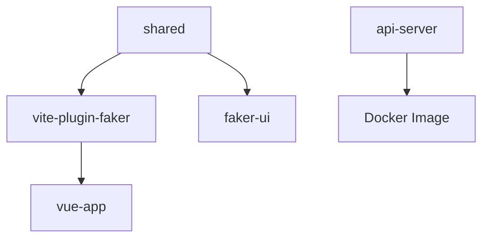

# CI/CD 策略文档

## 📋 概述

本文档描述了 `vite-plugin-faker` monorepo 的 CI/CD 策略和实现方案。

## 🏗️ 架构设计

### 项目结构

```
vite-plugin-faker/
├── packages/                    # 核心包
│   ├── vite-plugin-faker/      # 主插件包
│   ├── faker-ui/               # UI界面包
│   └── shared/                 # 共享工具包
├── playground/                  # 示例项目
│   ├── api-server/             # NestJS API服务器
│   └── vue-app/                # Vue示例应用
└── .github/workflows/          # CI/CD配置
```

### 核心原则

1. **智能变更检测** - 只构建和测试发生变更的项目
2. **并行执行** - 最大化利用GitHub Actions的并行能力
3. **依赖管理** - 正确处理项目间的依赖关系
4. **环境隔离** - 区分staging和production环境
5. **安全第一** - 集成安全扫描和依赖审查

## 🔄 CI/CD 流程

### 1. 变更检测 (detect-changes)

- 使用 `dorny/paths-filter` 检测哪些项目发生了变更
- 支持智能依赖检测（如 shared 包变更会触发所有依赖项目）

### 2. 基础设置 (setup)

- 安装依赖、代码检查、类型检查、格式检查
- 为后续job提供缓存的node_modules

### 3. 构建阶段

**并行构建以下组件：**

- `build-shared`: 构建共享包
- `build-test-plugin`: 构建和测试核心插件
- `build-ui`: 构建UI界面
- `build-test-api`: 测试和构建API服务器
- `build-vue-app`: 构建Vue示例应用

### 4. 质量保证

- **安全扫描**: 使用Trivy进行漏洞扫描
- **依赖审查**: 检查新增依赖的安全性和许可证
- **测试覆盖率**: 收集并上传到Codecov

### 5. 部署阶段

- **Docker镜像构建**: 为API服务器构建多架构镜像
- **NPM发布**: 自动发布核心插件到npm
- **环境部署**:
  - `develop` 分支 → staging环境
  - `main` 分支 → production环境

## 🚀 工作流详解

### 主要workflows

#### `ci-cd.yml` - 主CI/CD流程

- **触发条件**: push到main/develop分支，或PR到main分支
- **包含**: 完整的构建、测试、部署流程
- **特点**: 智能变更检测，只处理变更的项目

#### `dependency-review.yml` - 依赖审查

- **触发条件**: PR到main分支
- **功能**: 检查新增依赖的安全性和许可证合规性

#### `cleanup.yml` - 清理任务

- **触发条件**: 每日定时或手动触发
- **功能**: 清理旧的artifacts和Docker镜像

### 构建策略

#### 依赖管理



#### 并行优化

- 独立项目并行构建（api-server 独立于前端项目）
- 有依赖关系的项目按序构建（shared → plugin → vue-app）
- 使用artifacts在job间传递构建产物

## 🔧 配置详解

### 环境变量

- `NODE_VERSION`: Node.js版本 (20)
- `PNPM_VERSION`: pnpm版本 (9)
- `REGISTRY`: Docker镜像仓库 (ghcr.io)

### 必需的Secrets

- `GITHUB_TOKEN`: 自动提供，用于Docker镜像发布
- `NPM_TOKEN`: npm发布令牌
- `SLACK_WEBHOOK_URL`: Slack通知webhook (可选)

### 环境配置

- **staging**: 用于develop分支的预发布环境
- **production**: 用于main分支的生产环境

## 📦 包管理策略

### 版本管理

建议使用 [Changesets](https://github.com/changesets/changesets) 进行版本管理：

```bash
# 添加changeset
pnpm changeset

# 更新版本
pnpm version:patch

# 发布
pnpm release
```

### 发布流程

1. 开发者在PR中添加changeset
2. 合并到main分支后自动构建
3. 检查版本是否已存在于npm
4. 如果是新版本，自动发布到npm

## 🛠️ 本地开发

### 常用命令

```bash
# 检查变更的项目
pnpm ci:check-changes

# 构建变更的项目
pnpm ci:build-changed

# 测试变更的项目
pnpm ci:test-changed

# 检查是否需要发布
pnpm ci:check-publish packages/vite-plugin-faker

# 清理所有构建产物
pnpm clean
```

### 开发工作流

1. 创建功能分支
2. 开发和测试
3. 提交PR（会触发CI检查）
4. 代码审查
5. 合并到develop（部署到staging）
6. 测试验证
7. 合并到main（部署到production）

## 🚨 故障排除

### 常见问题

#### 1. 构建失败

- 检查依赖是否正确安装
- 确认TypeScript类型检查通过
- 查看具体的错误日志

#### 2. Docker构建失败

- 检查Dockerfile语法
- 确认构建上下文中包含必要文件
- 验证多架构构建支持

#### 3. 发布失败

- 确认NPM_TOKEN有效
- 检查package.json中的版本号
- 验证包名是否可用

### 调试技巧

- 使用GitHub Actions的debug日志
- 本地使用相同的命令进行测试
- 检查artifacts是否正确生成和传递

## 📈 性能优化

### 缓存策略

- Node.js模块缓存
- Docker层缓存
- GitHub Actions缓存

### 并行优化建议

- 继续细化项目粒度
- 优化Docker构建时间
- 考虑使用更快的测试运行器

## 🔄 持续改进

### 计划改进

1. 集成更多代码质量工具
2. 添加性能测试
3. 完善监控和告警
4. 优化构建速度

### 监控指标

- 构建时间
- 测试通过率
- 部署成功率
- 安全漏洞数量
